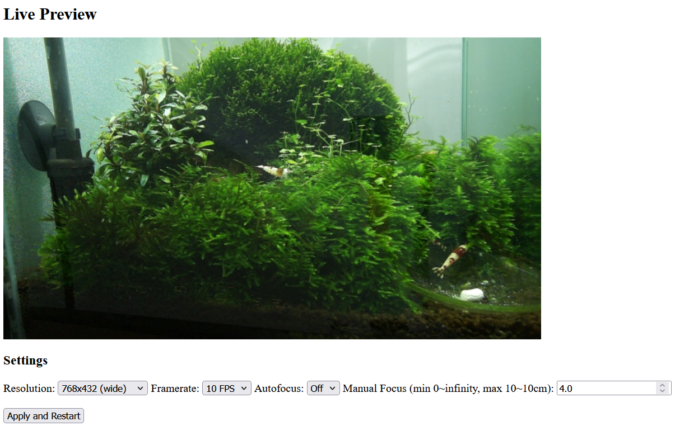
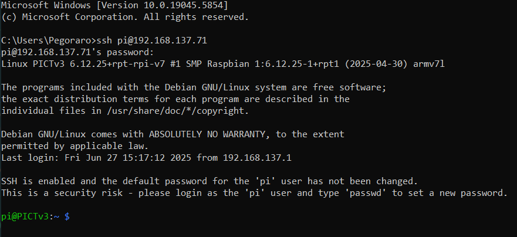

# PICT
A new an improved version of PICT ([Droissart *et al.*, 2021](https://besjournals.onlinelibrary.wiley.com/doi/full/10.1111/2041-210X.13618)), based on Bookworm OS. 

# Hardware
In this guide I assume you are using a [Raspberry Pi Zero W](https://www.raspberrypi.com/products/raspberry-pi-zero-w/) and a [Raspberry Pi Camera v3](https://www.raspberrypi.com/products/camera-module-3/) (with IR filter, non-wide). 

For more detailed hardware specifications, take a look at ['How to build PICT' guide](https://zenodo.org/records/6301001), most of the recommendations still apply. 

# Installation
## Quickstart
The easiest way to get started is to use one of the pre-built images I provide.

You can download image ISOs here (requires permission): https://drive.google.com/drive/u/2/folders/136YHJ19of67geJv1VAqPn2JNwlM1lIbM

Use a software like [Raspberry Pi Imager](https://downloads.raspberrypi.org/imager/imager_latest.exe) or [Balena Etcher](https://etcher.balena.io/) to flash one of these images to an SD card. 

> [!NOTE]
> If using [Raspberry Pi Imager](https://downloads.raspberrypi.org/imager/imager_latest.exe), when prompted write the image without modifying the configuration. 

Once flashing is complete, insert the SD card in your Pi ad connect to power; you might have to wait for up to 10 minutes for the first boot to complete. 

> [!NOTE]
> The OS images provided should auto-expand to fill all available space on the SD card; is that doesn't happen for some reason, you can use the [`raspi-config`](https://www.raspberrypi.com/documentation/computers/configuration.html#expand-filesystem) utility to do that on the Pi directly. 

## Installing the OS
Alternatively, you can also start from a stock Raspberry Pi image and follow the steps below.

Using Raspberry Pi Images v1.9.4 - https://downloads.raspberrypi.org/imager/imager_latest.exe 

Selecting these values in RPi Imager: 
 - Model: RPi Zero
 - OS version: Pi OS lite (32-bit) - no desktop, no dependencies

Selecting additional settings before flashing: 
 - Username: `pi` ; password: `raspberry`
 - WiFi SSID: `PICT_network_1` ; password: `pollinators1`
 - wireless LAN country: `CH`
 - locale: `EU/Zurich`
In "Services" tab: 
 - Enable SSH; use password authentication

# Connecting to the Pi
In the following section I assume the configuration outlined above, that assumes you are using a laptop or a smartphone as hotspot with this parameters: 
 - WiFi SSID: `PICT_network_1`
 - password: `pollinators1`
 - band: `2.4GHz`

The Pi is already configured to look for this network and connect to it. 

How you can verify if the Pi is connected to your hotspot varies depending on your device, but the steps are generally something like: 
 - Windows: Wi-Fi settings > Mobile hotspot
 - Android: Settings > W-Fi & Internet > Hotspot & tethering > Wi-Fi hotspot
    - Alternatively, you can download [NetAnalyzer](https://techet.net/netanalyzer/) and use the "LAN scan" function

What you are after is the IP address assigned to your Pi, as you will need this for the next steps.

## Live preview server
At boot, the Pi should automatically start a server showing the camera stream, which is useful to check framing and adjust parameters. 

To access the server, in any browser (both from laptop or smartphone) type in the IP address of your Pi, followed by port 7000. For example, in my case, I would need to type (the IP address will be different for you): 
```
192.168.137.71:7000
```

Press Enter and you should be presented with a screen like this: 


There are a few preset values for resolution, autofocus and manual focus you can choose from; click apply and wait for the server to restart. 

## Connect via SSH
Currently, to modify configuration and manually start recording, you need to connect to the Pi via SSH. 

To do so, you will need to open a terminal: 
 - Windows: press "Start", type `cmd`, press enter
 - Android: download [JuiceSSH](https://juicessh.com/) or [Termius](https://termius.com/), open that app

Type `ssh pi@[yourIPaddress]`, for example in my case: 
``` bash
ssh pi@192.168.137.71
```
type password `raspberry` when prompted. 

you should see a greeting message like this: 


The basic steps to get to this point are the same across platforms, but on smartphone apps the interface might be somewhat different. 

# Recording video
## crontab scheduling
To change when you want to start and stop the recording, you should use `crontab`. 

First, connect via SSH, then type: 
``` bash
crontab -e
```
and you should be presented with a text interface; scroll all the way to the bottom (on smartphone apps there often are special buttons for arrow keys), and you will see this snippet: 
``` bash
0 21 * * * sudo killall python
1 21 * * * sudo ifconfig wlan0 down
55 5 * * * sudo reboot
0 6 * * * /home/pi/start_video_v6.1.py
```

Brief explanation line by line: 
 - `0 21 * * * sudo killall python` means: at 21:00, stop all python processes (i.e. any recording in progress)
 - `1 21 * * * sudo ifconfig wlan0 down` means: at 21:01, switch off Wi-Fi
 - `55 5 * * * sudo reboot` means: at 5:55, reboot the system
 - `0 6 * * * /home/pi/start_video_v6.1.py` means: at 6:00, start recording using script `start_video_v6.1.sh`

If you want to change the recording times, simply modify the corresponding lines, respecting the format `mm HH * * * command` as shown above. 

When done, exit by pressing <kbd>Ctrl</kbd> + <kbd>X</kbd> (or equivalent buttons on smartphone apps). 

## Change recording parameters
For now, the only way to change recording parameters like resolution, focus mode, etc is to directly modify the Python script.

The scripts are located in the root of this repo, you should use the most recent one, in this case `videos_v6.1.py`. 

To open the file, type: 
``` bash
nano videos_v6.1.py
```

You will be presented with a text interface; navigate down using the arrow keys (or equivalent button on smartphone apps) and find this code block (starts at line 13): 
```python
### Parameters declaration
video_duration = 1800
video_number = 336
resolution = (1536, 864)  # Set the desired resolution as (width, height), WIDE format
target_fps = 10
focus = "Manual"  # Set to "Auto" or "Manual"
focus_distance = 4  # Only used if Focus is "Manual"; 0 (infinity) and 10.0 (approx. 10cm); default is 0.5 (focus at ~1m))
video_dir = "/home/pi/record/videos/"
os.makedirs(video_dir, exist_ok=True)
```

This is where you can modify the recording parameters; most variables are self-explanatory, but `video_duration` is expressed in seconds (e.g. 1800 second = 30 minutes); `video_number` is hwo many videos to record (e.g. 336 / 2 / 14 = 12 days of recording 14 hours per day, videos of 0.5 hours); `focus_distance` is expressed in dioptres, 1/focus_distance (e.g. 1/4 = 25 cm). 

Modify the desired parameters, then pres <kbd>Ctrl</kbd> + <kbd>X</kbd> (or equivalent buttons on smartphone apps), confirm overwriting with the same name. 

## Start recording manually
If you want to start recording manually, you can do so by running the dedicate `.sh` scripts, use the one named as the python file you want to use, in this case `start_video_v6.1.sh`. 

You can run these files by typing: 
``` bash
./start_video_v6.1.sh
```

These files will stop the live server, if active, log the output of the python script and prevent another recording to automatically start. 

## Recording autostart
There is a service running on the Pi that monitors user activity, and if none is detected (i.e. connection to SSH, open web browser with live preview server, running commands), after 10 minutes the recording will start using the latest shell script,. in this case `start_video_v6.1.sh`. 

If there is already a recording in progress (e.g. it was started manually), a new one will not be triggered. 

# Changelog
<!-- *v3.1.0* - working towards a cleaned version of the repo to be cloned directly on the Pi.

[...] -->

*v3.0.3* - cleaning up repo, writing instructions

*v3.0.2* - implementing managing of preview server and recording via system services

*v3.0.1* - implementation of live preview server based on `uvicorn`.

*v3.0.0* - re-hash of older software based on Pi OS Buster; the reason is that RPi camera v3 is incompatible with the `picamera` stack... 